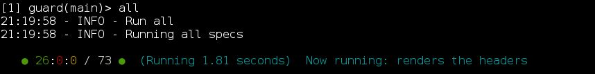
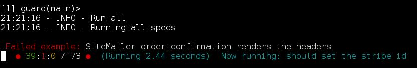

# Dots formatter

An RSpec formatter that has nothing to do with dots, honest.

Format your Rspec output simply, but informatively.

For example, running with guard, your RSpec output could look like
this:

)

Or get instance feedback when an example fails:

)

If you set debug mode to true then you can get each test on a new line
with the time taken for each test.

Currently only works with RSpec 3 and up.

To run, clone the repo then in either a project specific .rspec file or
in your home .rspec file, or directly on the command line:

```ruby
--require /path/to/dots_formatter/dots_formmater.rb
--format DotsFormatter
```


## TODO

* Port RSpec 3 to RSpec 2
* Better Readme
* Gem-ify
* Debug as command line option
* Tests
